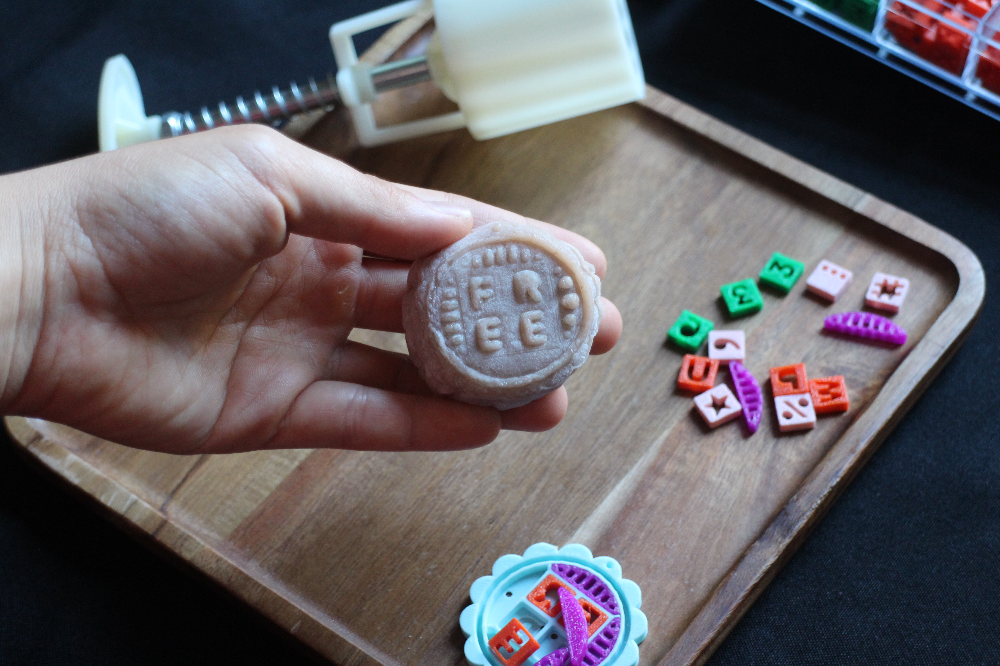

# Protest Food 
**By [Pepi Ng](https://pepzicles.com/)**  

 

## About 
Protest Food consists of three parts: 

### 1) Protest Mooncake Workshop

This workshop encourages participants to merge personal, cultural, and political expression through food. 

Participants can create and consume mooncakes with personalized protest messages. They get to create their own mooncake stamps using 3D-printed letters, numbers, symbols and designs, and imprint the messages on the stamps on the mooncakes.

You can find all 3D models [here](https://github.com/pepzicles/protestFoodV2/tree/main/3D%20models).

This workshop was heavily inspired by [Hong Kong’s Anti-Extradition Mooncakes](https://protestfood.com/item.html?id=8), as well as my own heritage.

 

 

### 2) [Protest Food Book](https://protestfood.com/book.html)

A 200-page book featuring nine different stories of how food is used as a medium of strength, solidarity and resistance around the world today.

The book features stories of:
1. Anti-Extradition Mooncakes, Hong Kong
2. La Morada Mutual Aid Kitchen, NYC, USA
3. Gaza Soup Kitchen, Gaza, Occupied Palestine
4. The Okra Project, NYC, USA
5. Bake for Ukraine, Ukraine
6. Vegetables Without Borders, Rotterdam, Netherlands
7. Prison Agriculture Lab, USA
8. Food Sovereignty Ghana, Ghana
9. Kenya National Alliance of Street Vendors and Informal Traders (KENASVIT), Kenya

You can download the pdf version of the book [here](https://github.com/pepzicles/protestFoodV2/blob/main/book/ProtestFood_Book.pdf).

 

### 3) [Protest Food Online Archive](https://protestfood.com/)

A hand-coded interactive online archive documenting food’s role in social movements globally and historically. 

You can filter entries by category, scale, date, region, and topic — and even submit your own examples, making it a living, participatory record. 

You can view the archive on desktop and mobile at [protestfood.com](https://protestfood.com/).

You can also download the data of my archive from this [json file](https://github.com/pepzicles/protestFoodV2/blob/main/data.json).

 

## Contact

This project is constantly updating and evolving as I explore more of food's role in politics and resistance. I would love to continue iterating on this project. If you have ideas/ would like to chat, please contact me at [yiqing.ng@gmail.com](yiqing.ng@gmail.com)

 

## Credits

This project really would not have been possible without the help of so many individuals. Thank you all so much. 

- **Brainstorming, ideating and helping me along the way:** Julia Daser
- **Recommendations and resources:** Professor Alexandra Délano Alonso and Tench Cholnoky
- **All interviewees:** T, Jon Rubin, Dawn Weleski from Conflict Kitchen, Orang Laut, Emily Li, Abed Ajrami from Gaza Soup Kitchen, Marco Saavedra and Natalia Méndez from La Morada, Gilbert Goh from Love Aid SG, Joshua Sbicca from Prison Agriculture Lab, Felicity Spector from Bake for Ukraine, Brian Hioe from New Bloom Magazine, Mirtilla LaResdòra from Groenten Zonder Grenzen Rotterdam, Gabrielle Inès Souza from The Okra Project, Anthony Kwache from KENASVIT, Edwin Baffour from Food Sovereignty Ghana, Orang Laut team.
- **Guidance and mentorship:** Professors Kellee Massey, Ayo Okunseinde, Jesse Harding, Kia Gregory, Richard The, Jack Jin Gary Lee
- **Editing my book:** Professor Jesse Harding
- **Contributing to my archive:** Krish, Maite, Maryam, Jana, Oritz Victoria, Zang Yi, Daltin Danser, Lara Arditi, Bob Shi, Vanessa Shimon, Sanchi Paruthi, Joa Sapicas, Varda Durandisse , Kuhoo Bhatnagar, Julia Shwe, Maiia Lysytska, Eloise Yalovitser, Ahona Paul , Grace Park, Natalia Cortina, Nathan Williams, Madina Masimova, Noor Bishor, Emily Li, Amanda Phyu Sin Thu, Adan Abbas, Dida Aljabari, Aparna Krishnan, Mirtilla LaResdòra, Julia Daser
- **User testing:** All D12 classmates
- **Printing:** Design Lab at The New School, Emily Li
- **Grant/ Funding:** New School Student Research Award (University Student Senate and the Office of the President)
